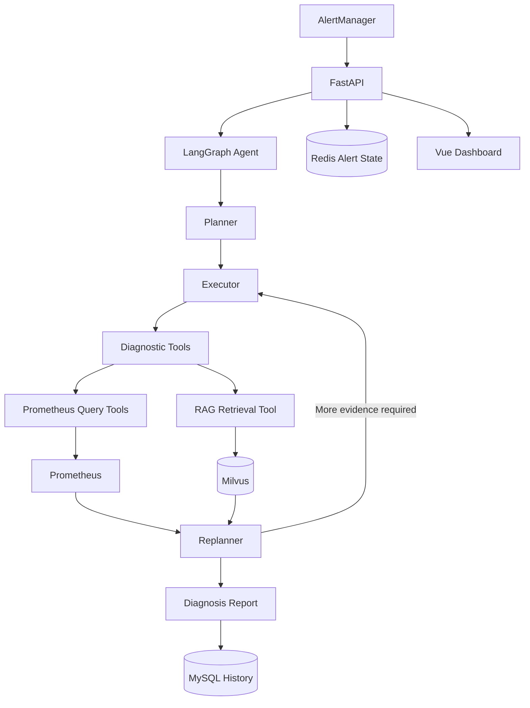
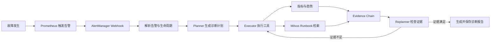
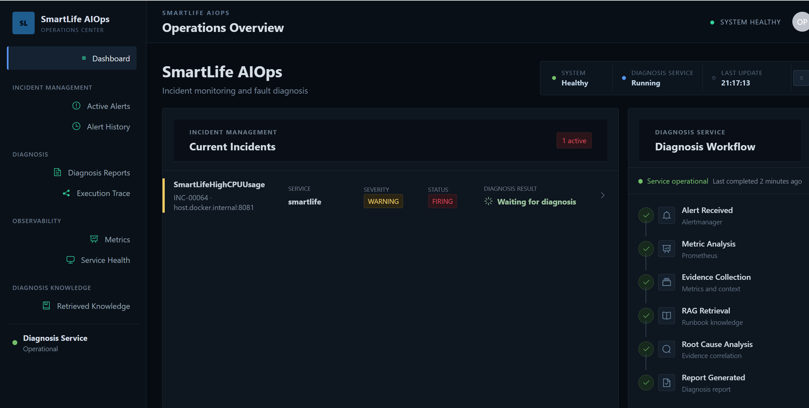
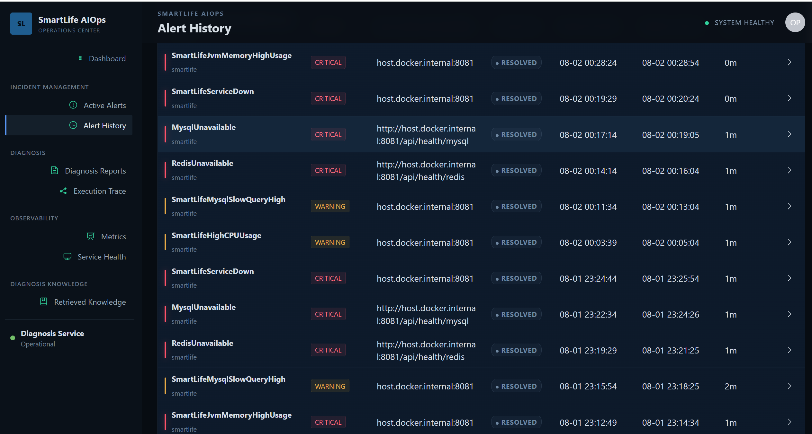
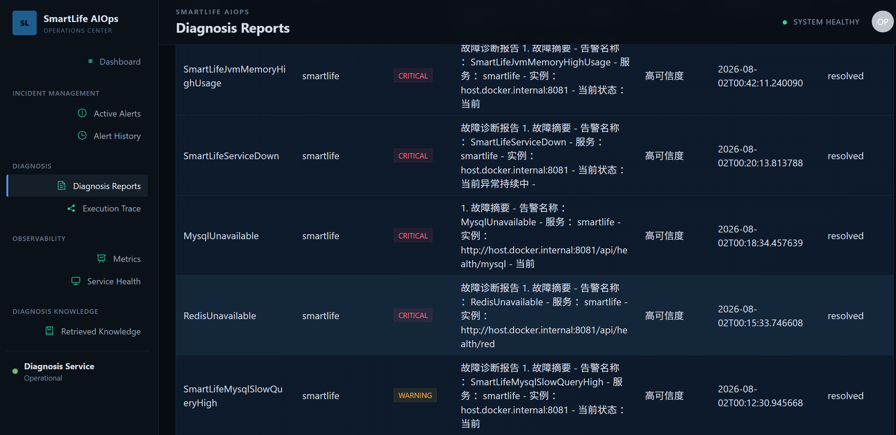

# Agentic AIOps Fault Diagnosis Platform

基于 LLM Agent、Prometheus 与 RAG 的智能故障诊断平台：自动分析告警、组织诊断证据并生成故障报告。

## Project Overview

生产系统中的 CPU、JVM、数据库、缓存和服务可用性告警往往需要工程师在多个监控页面与 Runbook 之间反复排查。告警数量增加后，人工定位速度和诊断结论的一致性都会受到影响。

本项目将告警处理组织为可执行的 LangGraph 工作流。系统接收 AlertManager webhook，由 Planner 生成排查计划，Executor 查询 Prometheus 指标并检索运维知识库，Replanner 检查证据完整性，最终输出可追溯的 Markdown 诊断报告。

平台定位是辅助故障分析：整理监控证据、关联 Runbook、缩短人工排查路径，不执行生产环境自动修复。

## Architecture



## Workflow



一次诊断会通过 SSE 返回计划、步骤结果和最终报告。告警当前状态保存在 Redis，告警生命周期、执行证据和诊断报告保存在 MySQL。

## Features

### Alert Lifecycle Management

接收 AlertManager firing/resolved 通知，解析告警名称、服务、实例、指纹和时间。系统会校准 AlertManager、Redis 与 MySQL 状态，补偿可能遗漏的恢复通知。

### Agent-based Diagnosis

Planner、Executor、Replanner 组成单个 LangGraph 诊断工作流。Planner 输出异常时有确定性 fallback，工具失败会被记录，报告生成失败时可基于已有证据生成降级报告。

### Prometheus Metric Analysis

支持 PromQL 即时查询、时间范围查询和当前活动告警查询。诊断策略按告警类型选择指标，结合当前值与趋势形成监控证据。

### RAG Knowledge Retrieval

支持索引 Markdown、TXT、PDF 和 DOCX 运维文档，通过 Embedding 与 Milvus 检索相关 Runbook。故障映射配置会限制指标、检索词和允许引用的文档范围。

### Automated Fault Evaluation

Evaluation Runner 可在测试环境触发 HTTP 或 Docker 故障，等待告警和诊断报告，检查识别与根因匹配，并在结束后恢复故障、确认告警 resolved。

### Web Dashboard

Vue 控制台展示当前告警、历史记录、服务状态、Prometheus 证据、诊断过程、执行轨迹和完整 Markdown 报告，并支持从告警详情页启动诊断。

## Supported Faults

| Fault | Alert | Primary evidence | Knowledge reference | Status |
| --- | --- | --- | --- | --- |
| CPU 使用率过高 | `SmartLifeHighCPUUsage` | `process_cpu_usage` 及 10 分钟趋势 | CPU / Java 高 CPU Runbook | Implemented |
| JVM Heap 过高 / OOM 风险 | `SmartLifeJvmMemoryHighUsage` | Heap used/max、OOM 状态、GC 指标 | JVM OOM / Full GC Runbook | Implemented |
| MySQL 慢查询 | `SmartLifeMysqlSlowQueryHigh` | 故障状态、执行次数、最近耗时与趋势 | MySQL 慢 SQL Runbook | Implemented |
| MySQL 服务不可用 | `MysqlUnavailable` | `probe_success{job="smartlife-health-mysql"}` | MySQL 服务不可用 Runbook | Implemented* |
| Redis 服务不可用 | `RedisUnavailable` | `probe_success{job="smartlife-health-redis"}` | Redis 服务不可用 Runbook | Implemented* |
| Spring Boot 服务不可用 | `SmartLifeServiceDown` | `up{job="smartlife"}` 及趋势 | 服务启动 / 网络排查 Runbook | Implemented |

Prometheus 和 AlertManager 需要单独部署，并加载：

- `monitoring/prometheus.yml`
- `monitoring/rules/`
- `monitoring/alertmanager.yml`

其中业务服务 `smartlife-platform` 作为被监控应用，提供 Prometheus 指标和故障注入接口，用于模拟真实生产故障场景。

相关业务告警规则位于 `smartlife-platform` 项目中。
## Evaluation

当前评测覆盖 6 类故障场景，其中 6 类成功完成告警识别、诊断报告生成与恢复检测。数据如下：

| Metric |    Result |
| --- |----------:|
| Tests |         6 |
| Successful tests |         6 |
| Diagnosis success rate |      100% |
| Fault identification accuracy |      100% |
| Root cause match rate |      100% |
| Evidence consistency |      100% |
| Alert resolved rate |      100% |
| Average diagnosis time | 193.801 s |

## Screenshots

### Dashboard

> 

### Diagnosis Process

> 

### Diagnosis Report

> 

## Related Project

本项目依赖配套业务服务 `smartlife-platform`：

- Spring Boot 业务服务
- Prometheus Metrics
- 故障注入接口
- MySQL / Redis 测试环境

完整 AIOps 流程如下：

1. 启动 smartlife-platform
2. 启动 smartlife-aiops
3. 启动 Prometheus
4. 启动 AlertManager
### 1. 安装依赖

```bash
uv sync --extra dev
```

### 2. 启动基础设施

```bash
docker compose -f vector-database.yml up -d
```

该文件启动 Redis、MySQL、Milvus、etcd、MinIO 和 Attu，不包含 Prometheus 与 AlertManager。

Prometheus 和 AlertManager 通过 Docker 容器随 smartlife-platform 项目启动，并加载其中的 Prometheus 配置、AlertManager 配置以及业务告警规则。smartlife-platform 作为被监控业务服务，提供 Prometheus Metrics 和故障注入接口，用于模拟真实生产故障场景。
### 3. 建立知识库

```bash
python scripts/index_knowledge.py
```

### 4. 启动后端

```bash
python -m uvicorn app.main:app --host 0.0.0.0 --port 9900
```

API 文档：`http://127.0.0.1:9900/docs`

### 5. 启动前端

```bash
cd frontend
npm install
npm run dev
```

更详细的环境变量、监控网络和评测配置请参见项目内说明及配置文件。

## Project Structure

```text
smartlife-aiops/
├── app/
│   ├── main.py                    # FastAPI 入口
│   ├── config.py                  # 应用与外部服务配置
│   ├── agent/aiops/
│   │   ├── planner.py             # 诊断任务规划
│   │   ├── executor.py            # 诊断工具执行
│   │   ├── replanner.py           # 证据检查与报告生成
│   │   └── state.py               # LangGraph 状态
│   ├── api/                       # 告警、诊断与 Dashboard API
│   ├── services/                  # 工作流、RAG、状态与持久化
│   ├── tools/                     # Prometheus、RAG、时间、JVM 工具
│   └── core/                      # LLM、Milvus、故障映射
├── data/
│   ├── config/fault_mapping.yaml  # 告警诊断策略
│   └── knowledge/                 # Runbook 与知识文档
├── evaluation/                    # 故障注入与自动评测
├── frontend/                      # Vue 3 运维控制台
├── monitoring/                    # Prometheus 与 AlertManager 配置
├── scripts/                       # 知识索引和数据库迁移
├── tests/                         # 自动化测试
├── vector-database.yml            # 本地基础设施
├── pyproject.toml
└── uv.lock
```

## Future Work

- 扩展更多业务与基础设施故障类型。
- 增加 JVM、数据库、缓存和应用层监控指标。
- 接入真实应用日志、Spring Boot health 和数据库诊断工具。
- 加强工具输入、输出与证据有效性校验。

## Safety

- 不要提交 `.env`、API Key、密码、日志、本地数据库或 Docker volume 数据。
- `vector-database.yml` 中的默认密码仅适用于本地开发。
- Evaluation 会注入故障并操作 Docker 容器，只能在隔离且已授权的测试环境运行。
- 诊断报告用于辅助排障，生产变更仍需人工复核和审批。
